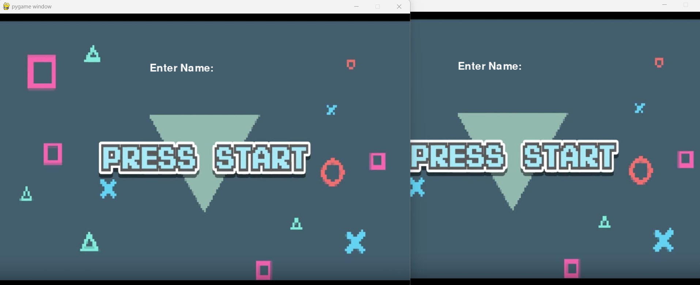
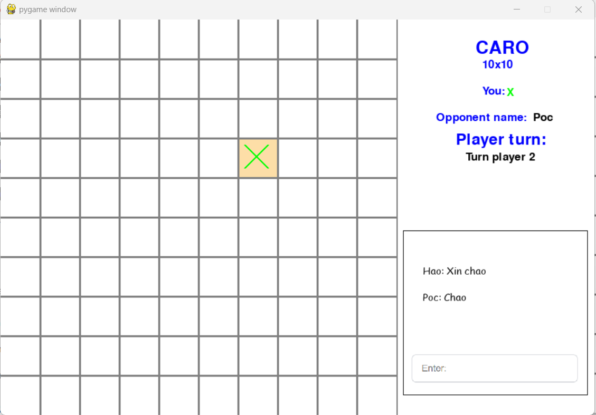
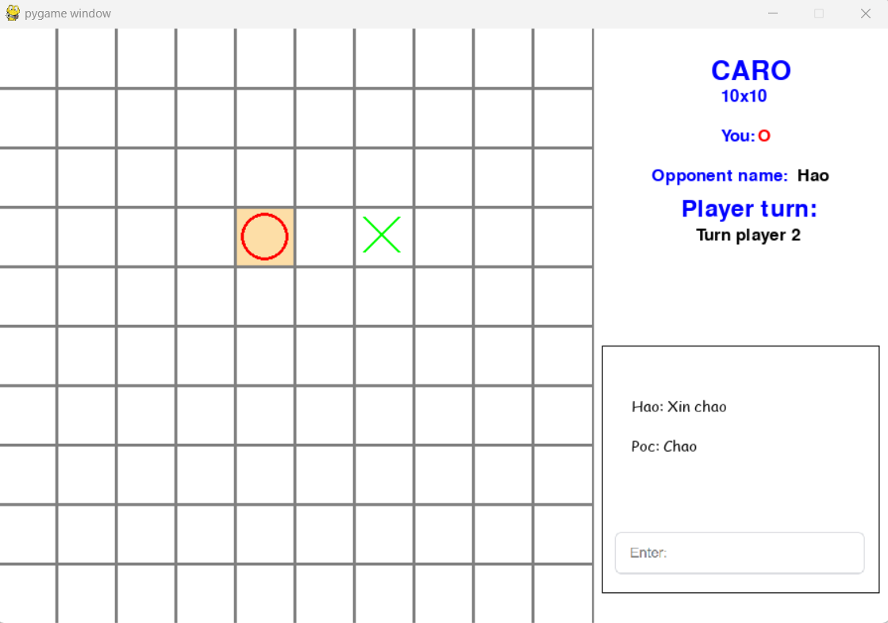
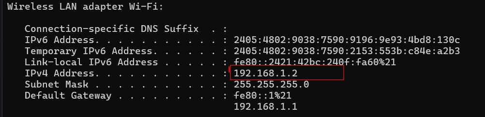
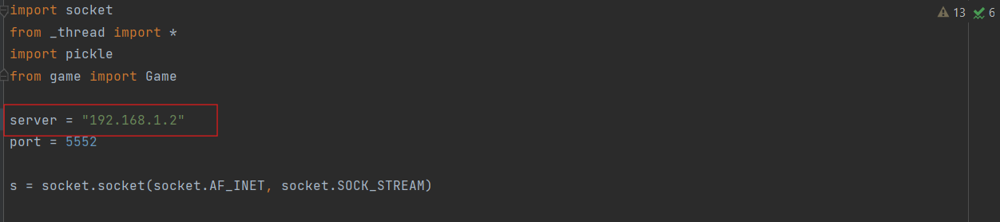
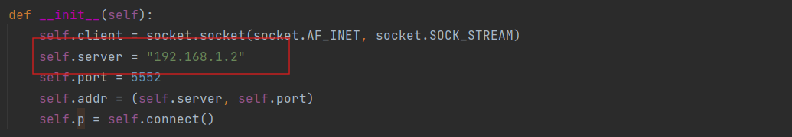
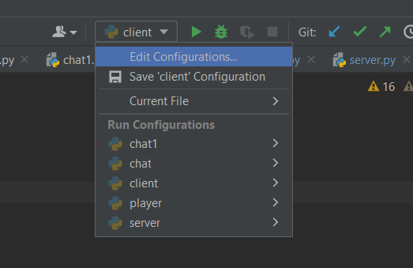
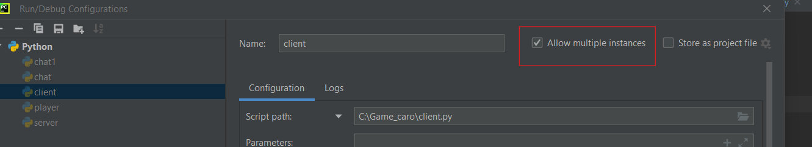

# REACT

  

# Introduce

Two-player caro game using Lan network using Socket and while people can chat with each other

<p align="center">  </p>

<p align="center">  </p>

<p align="center">  </p>

## Install

Install library;

```
pip install pygame
```

```
pip install socket
```

```
pip install pickle
```

## How to run

First you need to change the Wireless LAN:

- Step 1 - Get IP:
  - Open Comman Prompt
  - Write `ipconfig                  `

* Step 2 - Copy IP:
<p align="center"> 
 </p>
* Step 3 - Change ip in Server.py and Network.py:
   <p align="center"> 
    </p>
    <p align="center"> 
    </p>

* Step 4 - how to run 2 client.py:
  - Click client.py
  - Click Edit Configurations
  - Click Allow
  <p align="center">  </p>
  
    <p align="center"> 
  </p>
* Step 5 - Run server.py and two times client.py
